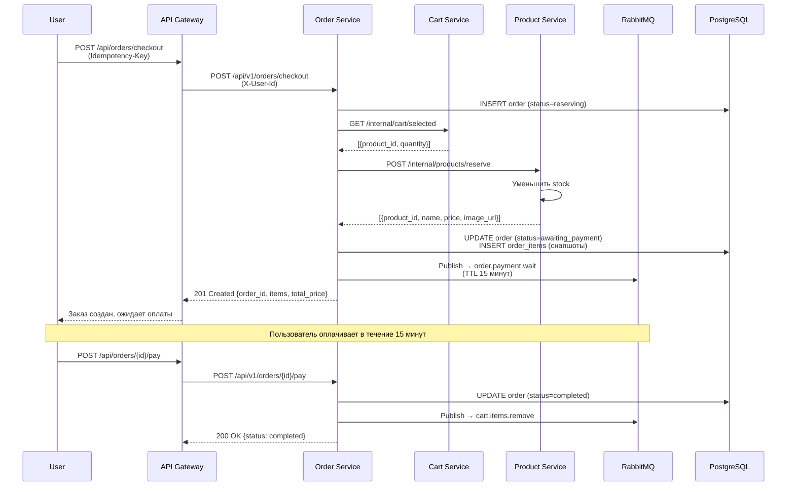
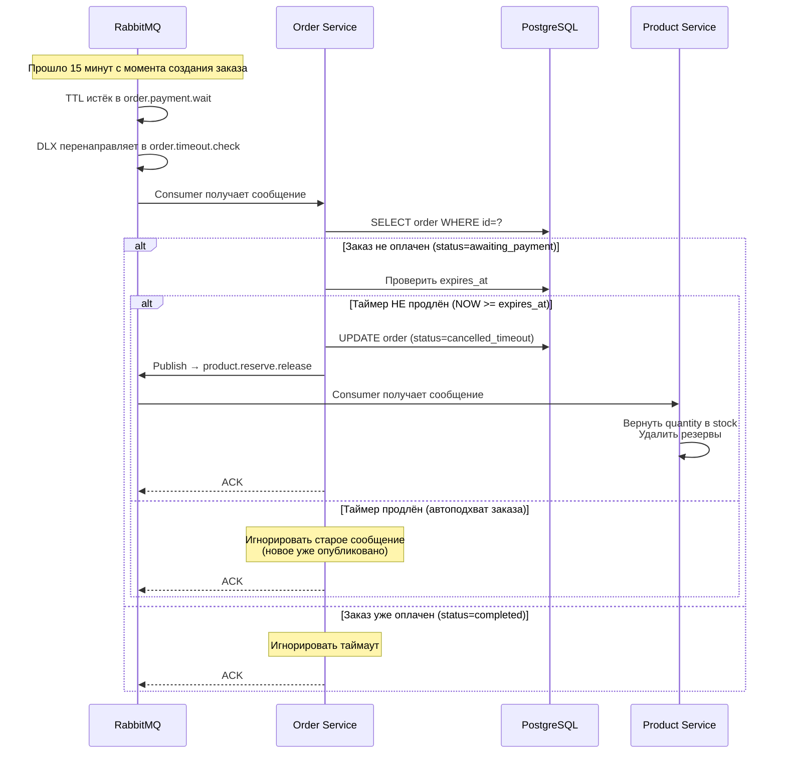

# Order Service

> Микросервис для интернет-магазина электроники. Главный репозиторий: [microservices-shop/overview](https://github.com/microservices-shop/overview)

## Tech Stack


## Описание

Микросервис управления заказами. Координирует распределённые транзакции между сервисами корзины и каталога товаров, реализуя паттерн **Orchestration Saga**.

Order Service выступает оркестратором при оформлении заказа: резервирует товары в Product Service, создаёт заказ со снапшотами, запускает таймер оплаты (15 минут), и при успешной оплате асинхронно очищает корзину в Cart Service через RabbitMQ. При таймауте или отмене — возвращает резервы обратно на склад.

**Основной функционал:**
- **Оформление заказов** — создание заказа из выбранных товаров корзины с резервированием на складе (Product Service) и сохранением снапшотов (цена, название, фото на момент оформления)
- **Оплата заказов** — фиктивная оплата с переходом заказа в статус `completed` и асинхронной очисткой корзины через RabbitMQ
- **История заказов** — просмотр завершённых заказов пользователя с пагинацией и детальной информацией по каждому заказу
- **Автоматическая отмена** — таймер на 15 минут с автоматической отменой неоплаченного заказа и возвратом зарезервированных товаров на склад
- **Защита от дублей** — идемпотентность через заголовок `Idempotency-Key` и автоматический подхват существующих неоплаченных заказов при повторном оформлении
- **Отказоустойчивость** — retry-механизм с экспоненциальным backoff при сбоях интеграций с Cart/Product Service, структурированное логирование с request tracing

## Структура проекта

```
order-service/
├── src/
│   ├── api/
│   │   ├── v1/
│   │   │   ├── orders.py          # REST эндпоинты
│   │   │   └── router.py          
│   │   └── dependencies.py        
│   ├── db/
│   │   ├── database.py            # Конфигурация БД
│   │   └── models.py              # SQLAlchemy модели
│   ├── repositories/
│   │   └── order.py               
│   ├── services/
│   │   ├── order.py              
│   │   ├── cart_client.py         
│   │   └── product_client.py      
│   ├── messaging/
│   │   ├── broker.py              
│   │   ├── publisher.py           
│   │   ├── consumers.py          
│   │   └── schemas.py             
│   ├── middleware/
│   │   └── request_logger.py     
│   ├── schemas/                   # Pydantic схемы
│   │   ├── orders.py              
│   │   └── internal.py            
│   ├── config.py                  # Конфигурация (pydantic-settings)
│   ├── logger.py                  
│   ├── exceptions.py              
│   └── main.py                    # Точка входа приложения
├── alembic/                       # Миграции БД
├── tests/                       
│   ├── api/                     
│   ├── service/                 
│   ├── unit/                    
│   ├── factories/               
│   └── conftest.py             
├── pyproject.toml                 
├── .env.example                  
└── README.md
```

## API

Сервис запускается на порту **8004**. Интерактивная документация доступна по адресу `http://localhost:8004/docs` (Swagger UI).

### Публичный API (`/api/v1/orders`)

| Метод  | Путь                        | Описание                                                      | Заголовки                                    |
|--------|-----------------------------|---------------------------------------------------------------|----------------------------------------------|
| `POST` | `/api/v1/orders/checkout`   | Оформление заказа (резервирование товаров, запуск таймера)    | `X-User-Id`, `Idempotency-Key`               |
| `POST` | `/api/v1/orders/{id}/pay`   | Оплата заказа (фиктивная, переход в статус `completed`)      | `X-User-Id`                                  |
| `GET`  | `/api/v1/orders`            | Список завершённых заказов (пагинация, превью товаров)       | `X-User-Id`                                  |
| `GET`  | `/api/v1/orders/{id}`       | Детали завершённого заказа (полные снапшоты товаров)         | `X-User-Id`                                  |

### Health Check

| Метод | Путь      | Описание           |
|-------|-----------|--------------------|
| `GET` | `/health` | Проверка здоровья  |

## RabbitMQ Интеграция

### Публикуемые очереди

| Очередь                   | Назначение                                    | Payload                                              |
|---------------------------|-----------------------------------------------|------------------------------------------------------|
| `order.payment.wait`      | Таймер оплаты (TTL 15 мин, DLX)               | `{"order_id": "UUID", "message_id": "UUID", ...}`    |
| `cart.items.remove`       | Очистка корзины после оплаты                  | `{"order_id": "UUID", "user_id": "UUID", "items": [...]}` |
| `product.reserve.release` | Возврат товаров при отмене/таймауте           | `{"order_id": "UUID", "message_id": "UUID", ...}`    |

### Подписки (Consumers)

| Очередь              | Обработчик          | Описание                                    |
|----------------------|---------------------|---------------------------------------------|
| `order.timeout.check`| `process_timeout()` | Обработка таймаута неоплаченных заказов     |

## Flow диаграммы

### Оформление заказа:



### Обработка таймаута:



## Установка и запуск

### Требования

- Python 3.12+
- PostgreSQL 14+
- RabbitMQ 3.12+

### Разработка

```bash
# Установка зависимостей
uv sync

cp .env.example .env

# Запуск PostgreSQL
docker-compose -f docker-compose.dev.yml up -d

# Миграции БД
alembic upgrade head

# Запуск сервиса
uvicorn src.main:app --reload --port 8004 --no-access-log
```

### Production

```bash
docker-compose up --build -d
```

## Тестирование

```bash
# Запуск всех тестов
pytest

# С покрытием
pytest --cov=src --cov-report=html
```

**Coverage report:** 90%

## Что можно улучшить

- [ ] **Transactional Outbox** — гарантированная доставка сообщений в RabbitMQ через паттерн Outbox (запись событий в БД в той же транзакции, отдельный процесс для публикации)
- [ ] **Метрики** — интеграция с Prometheus (количество заказов, время резервирования, процент отмен, latency)
- [ ] **Логи в Grafana** — централизованный сбор логов через Loki для визуализации и алертинга
